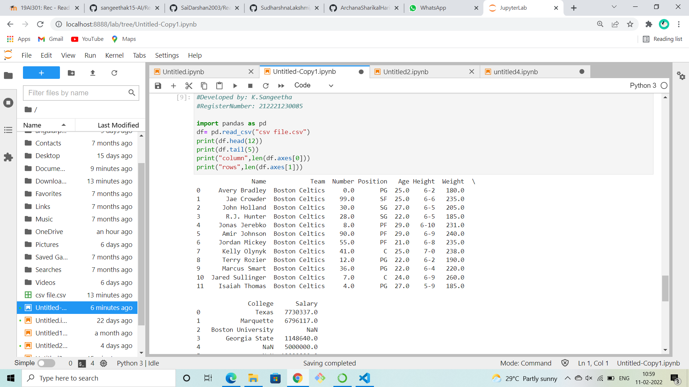
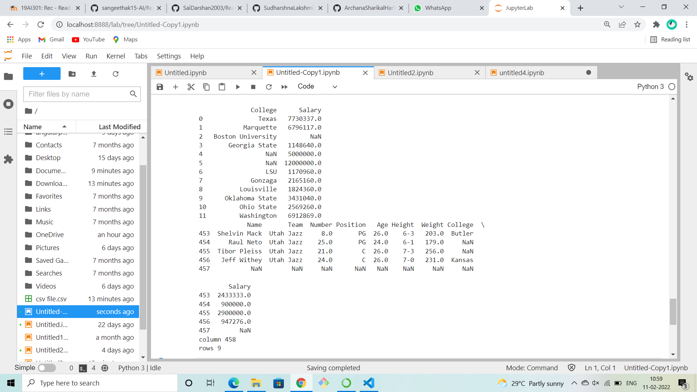

# Read-from-CSV

## AIM:
To write a python program to read data from CSV files.
## ALGORITHM:

### Step 1:
Start the python.
### Step 2:
Import pandas.
### Step 3:
The number of rows returned is defined in Pandas option settings.
### Step 4:
Read the contents of the CSV file using df.read function
### Step 5:
Increase the maximum number of rows to display the entire DataFrame.
## PROGRAM:
```
#Developed by: K.Sangeetha
#RegisterNumber: 212221230085

import pandas as pd
df= pd.read_csv("csv file.csv")
print(df.head(12))
print(df.tail(5))
print("column",len(df.axes[0]))
print("rows",len(df.axes[1]))

```
## OUTPUT:



## RESULT:
Thus the program is written to read the csv file.
